# AI-Enhanced LMS User Flows

## 1. Learner Journey - Course Completion Flow

## 2. Admin Management Flow

```mermaid
%%{init: {'theme': 'base', 'themeVariables': { 'primaryColor': '#f5f5f5', 'primaryTextColor': '#333', 'primaryBorderColor': '#666', 'lineColor': '#666', 'secondaryColor': '#f0f0f0', 'tertiaryColor': '#fff' }}}%%
flowchart TB
    subgraph AdminAuth["👨‍💼 Admin Access"]
        AA(["Admin Login"]) --> AB(["Admin Dashboard"])
    end
    
    subgraph CourseManagement["📚 Course Management"]
        AB --> AC(["Create New Course"])
        AC --> AD(["Add Multi-Format Content"])
        AD --> AE(["Configure Assessments"])
        AE --> AF(["Set Learning Path"])
        AF --> AG(["Assign Mandatory/Optional"])
    end
    
    subgraph UserManagement["👥 User Management"]
        AB --> AH(["Manage Users"])
        AH --> AI(["Create User Groups"])
        AI --> AJ(["Assign Courses"])
        AJ --> AK(["Set Permissions"])
    end
    
    subgraph Communication["📢 Communication"]
        AB --> AL(["Message Broadcasting"])
        AL --> AM(["Individual Messages"])
        AL --> AN(["Group Messages"])
        AL --> AO(["Organization-wide Announcements"])
    end
    
    subgraph Analytics["📊 Analytics & Monitoring"]
        AB --> AP(["Real-time Analytics"])
        AP --> AQ(["Individual Progress"])
        AP --> AR(["Course Completion Rates"])
        AP --> AS(["Leaderboards"])
        AP --> AT(["Performance Reports"])
    end
    
    classDef adminAuth fill:#dc262680,stroke:#dc2626,stroke-width:2px,color:#ffffff,font-family:Arial
    classDef courseManagement fill:#059669b0,stroke:#059669,stroke-width:2px,color:#ffffff,font-family:Arial
    classDef userManagement fill:#7c3aed80,stroke:#7c3aed,stroke-width:2px,color:#ffffff,font-family:Arial
    classDef communication fill:#ea580c80,stroke:#ea580c,stroke-width:2px,color:#ffffff,font-family:Arial
    classDef analytics fill:#0891b280,stroke:#0891b2,stroke-width:2px,color:#ffffff,font-family:Arial
    
    class AA,AB adminAuth
    class AC,AD,AE,AF,AG courseManagement
    class AH,AI,AJ,AK userManagement
    class AL,AM,AN,AO communication
    class AP,AQ,AR,AS,AT analytics
```

## 3. Assessment & Analytics Flow

## 4. Social Learning & Collaboration Flow

## 5. Personalized Learning Path Flow

```mermaid
%%{init: {'theme': 'base', 'themeVariables': { 'primaryColor': '#f5f5f5', 'primaryTextColor': '#333', 'primaryBorderColor': '#666', 'lineColor': '#666', 'secondaryColor': '#f0f0f0', 'tertiaryColor': '#fff' }}}%%
flowchart TB
    subgraph Profile["👤 User Profile Setup"]
        DA(["User Registration"]) --> DB(["Learning Style Assessment"])
        DB --> DC(["Career Goals Input"])
        DC --> DD(["Skill Level Evaluation"])
    end

    subgraph AIRecommendation["🤖 AI-Powered Recommendations"]
        DD --> DE(["AI Analyzes Profile"])
        DE --> DF(["Learning Pattern Analysis"])
        DF --> DG(["Smart Course Suggestions"])
        DG --> DH(["Personalized Learning Path"])
    end

    subgraph AdaptiveLearning["🎯 Adaptive Learning"]
        DH --> DI(["Visual/Auditory/Kinesthetic"])
        DI --> DJ(["Content Adaptation"])
        DJ --> DK(["Flexible Pacing"])
        DK --> DL(["Self-paced Learning"])
        DL --> DM(["Intelligent Scheduling"])
    end

    subgraph CareerAlignment["🎓 Career-Focused Learning"]
        DM --> DN(["Professional Goals"])
        DN --> DO(["Industry Requirements"])
        DO --> DP(["Skill Gap Analysis"])
        DP --> DQ(["Targeted Learning Plan"])
    end

    subgraph ContinuousImprovement["🔄 Continuous Optimization"]
        DQ --> DR(["Progress Monitoring"])
        DR --> DS(["Performance Analysis"])
        DS --> DT(["Path Adjustment"])
        DT --> DU(["Updated Recommendations"])
        DU --> DF
    end

    classDef profile fill:#6366f180,stroke:#6366f1,stroke-width:2px,color:#ffffff,font-family:Arial
    classDef aiRecommendation fill:#8b5cf680,stroke:#8b5cf6,stroke-width:2px,color:#ffffff,font-family:Arial
    classDef adaptiveLearning fill:#10b98180,stroke:#10b981,stroke-width:2px,color:#ffffff,font-family:Arial
    classDef careerAlignment fill:#f59e0b80,stroke:#f59e0b,stroke-width:2px,color:#ffffff,font-family:Arial
    classDef continuousImprovement fill:#ec489980,stroke:#ec4899,stroke-width:2px,color:#ffffff,font-family:Arial

    class DA,DB,DC,DD profile
    class DE,DF,DG,DH aiRecommendation
    class DI,DJ,DK,DL,DM adaptiveLearning
    class DN,DO,DP,DQ careerAlignment
    class DR,DS,DT,DU continuousImprovement
```

## User Flow Summary

The AI-Enhanced LMS provides comprehensive user flows covering:

1. **Learner Journey**: Complete course completion process with multi-format content and AI support
2. **Admin Management**: Full administrative control for course creation, user management, and communication
3. **Assessment & Analytics**: Real-time evaluation with event tracking and recognition systems
4. **Social Learning**: Collaborative features with peer interaction and expert mentorship
5. **Personalized Learning**: AI-driven adaptive learning paths aligned with career goals

Each flow ensures seamless user experience while capturing detailed analytics for continuous improvement and organizational insights.
